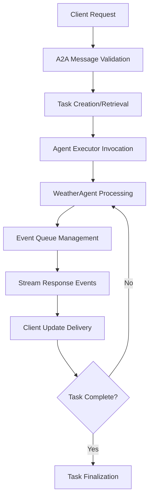
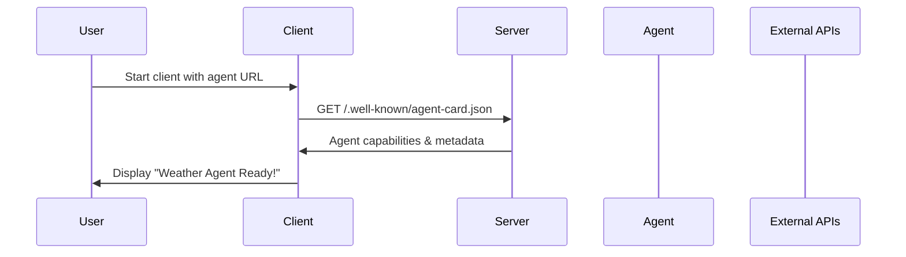
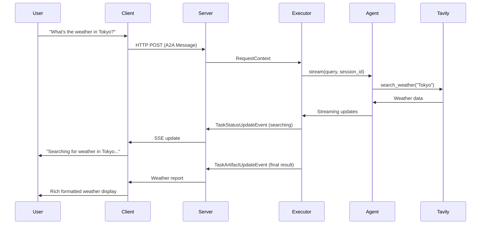
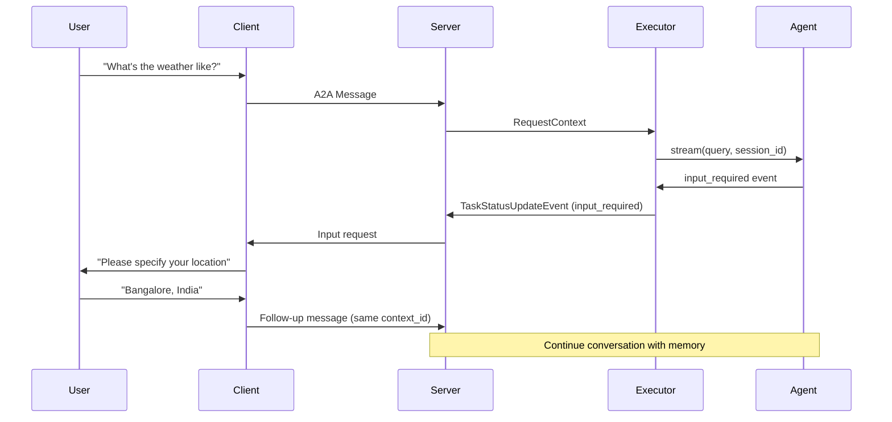

# A2A Weather Agent - Complete Architecture, Protocol & Implementation Guide

## 🎯 Project Overview

This project demonstrates a sophisticated **Agent-to-Agent (A2A) communication system** using the A2A protocol and Python SDK. It implements a real-time weather information service with streaming capabilities, multi-turn conversations, and event-driven architecture.

## 🌟 A2A Protocol Foundation

The **Agent-to-Agent (A2A) Protocol** is a standardized communication framework designed for seamless interaction between AI agents and clients. This implementation showcases the protocol's capabilities in a real-world weather information system.

### **A2A Protocol Core Principles**

#### **1. Protocol Specification**
- **JSON-RPC 2.0 Foundation**: Built on proven remote procedure call standards
- **Event-Driven Architecture**: Asynchronous communication via event streams
- **Agent Discovery**: Standardized metadata for capability negotiation
- **Multi-Modal Support**: Text, images, files, and custom content types
- **Real-Time Streaming**: Progressive response delivery with SSE/WebSocket

#### **2. Agent Compliance Requirements**

```python
# Required A2A Endpoints
/.well-known/agent-card.json    # Agent metadata and capabilities
/                               # Main communication endpoint
/health                         # Health check endpoint (optional)
```

#### **3. A2A Message Structure**

```json
{
  "jsonrpc": "2.0",
  "method": "agent.invoke",
  "params": {
    "message": {
      "kind": "message",
      "role": "user",
      "parts": [{"kind": "text", "text": "User query"}],
      "message_id": "unique-id",
      "task_id": "task-id",
      "context_id": "context-id"
    }
  },
  "id": "request-id"
}
```

---

## 📚 Libraries & Technologies Stack

### **Core A2A Framework**
- **`a2a-sdk`**: The foundation library providing A2A protocol implementation
  - `A2AStarletteApplication`: ASGI web application wrapper
  - `DefaultRequestHandler`: Handles HTTP requests and A2A protocol translation
  - `EventQueue`: Manages event-driven communication
  - `AgentExecutor`: Abstract base for agent execution logic

### **Web Framework & Server**
- **`Starlette`**: High-performance ASGI framework for async web applications
- **`sse-starlette`**: Server-Sent Events support for real-time streaming
- **`uvicorn`**: ASGI server for running the application
- **`httpx`**: Async HTTP client for API calls and push notifications

### **AI & Language Processing**
- **`LangChain`**: Framework for building applications with LLMs
  - `langchain-google-genai`: Google Gemini integration
  - `langchain-tavily`: Web search capabilities
  - `langgraph`: Graph-based agent workflows with memory
- **`LangGraph`**: Advanced agent orchestration with state management
  - `MemorySaver`: Persistent conversation memory
  - `create_react_agent`: ReAct (Reasoning + Acting) pattern implementation

### **External APIs**
- **Google Gemini 2.0**: Large Language Model for natural language processing
- **Tavily Search API**: Real-time web search for weather data

### **Development & Utilities**
- **`click`**: Command-line interface framework
- **`rich`**: Rich text and beautiful formatting for terminal output
- **`python-dotenv`**: Environment variable management
- **`pydantic`**: Data validation and serialization

---

## 🏗️ Implementation Architecture Deep Dive

### **Agent Card Implementation**

Our Weather Agent implements comprehensive metadata disclosure for A2A compliance:

```python
def build_agent_card(host: str, port: int) -> AgentCard:
    return AgentCard(
        name="Weather Agent",
        description="Real-time weather information with AI insights",
        url=f"http://{host}:{port}/",
        version="1.0.0",
        capabilities=AgentCapabilities(
            streaming=True,           # Progressive response delivery
            pushNotifications=True    # Proactive communication
        ),
        defaultInputModes=["text/plain"],
        defaultOutputModes=["text/plain"],
        skills=[
            AgentSkill(
                id="get_weather",
                name="Weather Information",
                description="Current weather with recommendations",
                tags=["weather", "realtime", "location-based"],
                examples=[
                    "What's the weather in Tokyo?",
                    "Should I bring an umbrella today?",
                    "Weather for outdoor activities in Denver?"
                ]
            )
        ]
    )
```

### **Request-Response Lifecycle**



## 🔄 A2A Event System Deep Analysis

### **Event Types in A2A Protocol**

#### **1. Task Events**
```python
# Task Creation
Task(
    id="unique-task-id",
    context_id="conversation-context",
    status=TaskStatus(state=TaskState.submitted),
    created_at=datetime.utcnow()
)

# Task Status Updates
TaskStatusUpdateEvent(
    taskId="task-id",
    contextId="context-id",
    status=TaskStatus(
        state=TaskState.working,
        message=AgentMessage(...)
    ),
    final=False
)
```

#### **2. Artifact Events**
```python
# Deliverable Content
TaskArtifactUpdateEvent(
    taskId="task-id",
    contextId="context-id",
    artifact=TextArtifact(
        name="weather_report",
        description="Current weather analysis",
        text="Formatted weather information"
    ),
    append=False,
    lastChunk=True
)
```

### **Event Queue Processing**

Our implementation uses an advanced event queue system for A2A compliance:

```python
class WeatherAgentExecutor(AgentExecutor):
    async def execute(self, context: RequestContext, event_queue: EventQueue):
        # 1. Task Initialization
        task = context.current_task or new_task(context.message)
        await event_queue.enqueue_event(task)
        
        # 2. Streaming Processing
        async for event in self.agent.stream(query, task.context_id):
            if event['is_task_complete']:
                # Final artifact delivery
                await event_queue.enqueue_event(
                    TaskArtifactUpdateEvent(...)
                )
            elif event['require_user_input']:
                # Input request handling
                await event_queue.enqueue_event(
                    TaskStatusUpdateEvent(state=TaskState.input_required)
                )
            else:
                # Progress updates
                await event_queue.enqueue_event(
                    TaskStatusUpdateEvent(state=TaskState.working)
                )
```

---

## 🌐 Network Protocol Implementation

### **Transport Layer**

```python
# Server-Side: Starlette ASGI Application
server = A2AStarletteApplication(
    agent_card=build_agent_card(host, port),
    http_handler=DefaultRequestHandler(...)
)

# Client-Side: HTTP/SSE Communication
async with httpx.AsyncClient() as http_client:
    card_resolver = A2ACardResolver(http_client, agent_url)
    agent_card = await card_resolver.get_agent_card()
    
    config = ClientConfig(httpx_client=http_client)
    factory = ClientFactory(config)
    client = factory.create(agent_card)
```

### **A2A Streaming Implementation**

```python
# Server Streaming via SSE
async for update in client.send_message(message):
    # Real-time event processing
    if isinstance(update, tuple):
        task, metadata = update
        # Handle different task states
        if task.status.state == TaskState.completed:
            # Final response processing
        elif task.status.state == TaskState.input_required:
            # Multi-turn conversation handling
```

### **1. Agent Layer (`agent.py`)**

```python
class WeatherAgent:
    - Uses LangChain's ReAct pattern
    - Integrates Google Gemini 2.0 for reasoning
    - Implements Tavily search tool for real-time weather data
    - Maintains conversation memory with MemorySaver
    - Structured response format with Pydantic models
```

**Key Features:**
- **Multi-turn Conversations**: Uses `thread_id` for session management
- **Tool Integration**: `search_weather` tool with error handling and fallbacks
- **Structured Responses**: Pydantic models ensure consistent output format
- **Stream Processing**: Async generator for real-time updates

**Flow within Agent:**
1. Receives user query with session context
2. Uses LangGraph's ReAct agent for reasoning
3. Calls search_weather tool if location provided
4. Formats response with emojis and actionable advice
5. Returns structured status (completed/input_required/error)

### **2. Agent Executor Layer (`agent_executor.py`)**

```python
class WeatherAgentExecutor(AgentExecutor):
    - Bridges agent logic with A2A protocol
    - Manages task lifecycle (creation, updates, completion)
    - Handles event queue orchestration
    - Converts agent responses to A2A events
```

**Event Types Managed:**
- **TaskArtifactUpdateEvent**: Final weather reports
- **TaskStatusUpdateEvent**: Progress updates and input requests
- **Task Creation**: New task generation for conversations

**Communication Flow:**
1. Receives RequestContext from A2A server
2. Extracts user input and task information
3. Streams through WeatherAgent responses
4. Converts each response to appropriate A2A events
5. Manages task state transitions

### **3. Server Layer (`__main__.py`)**

```python
A2AStarletteApplication:
    - ASGI web application using Starlette
    - Implements A2A protocol endpoints
    - Provides agent discovery via /.well-known/agent-card.json
    - Handles HTTP/JSON-RPC communication
```

**Server Components:**
- **Agent Card**: Metadata for agent discovery and capabilities
- **Request Handler**: Routes requests to appropriate executors
- **Task Store**: In-memory task state management
- **Push Notifications**: Real-time updates to clients

**API Endpoints:**
- `/.well-known/agent-card.json`: Agent capabilities and metadata
- `/`: Main A2A communication endpoint
- WebSocket/SSE support for streaming

### **4. Client Layer (`client.py`)**

```python
A2A Client Features:
    - Dynamic agent discovery
    - Streaming response handling
    - Multi-turn conversation management
    - Rich terminal interface
```

**Client Workflow:**
1. **Discovery Phase**: Fetches agent capabilities
2. **Connection Setup**: Initializes A2A client with HTTP transport
3. **Message Sending**: Constructs A2A-compliant messages
4. **Stream Processing**: Handles real-time updates
5. **Conversation Flow**: Manages multi-turn interactions

---

## 🔄 Detailed Communication Flow

### **Phase 1: System Initialization**



### **Phase 2: Single-turn Interaction**



### **Phase 3: Multi-turn Conversation**



---

## 🛠️ Event-Driven Architecture Deep Dive

### **Event Queue System**

The A2A protocol uses an event-driven architecture where all communication flows through event queues:

```python
# Event Types and Their Purpose
TaskArtifactUpdateEvent:
    - Contains final deliverables (weather reports)
    - Includes artifact metadata and content
    - Marks completion with lastChunk=True

TaskStatusUpdateEvent:
    - Progress updates ("searching", "processing")
    - Input requests (location clarification)
    - Error states and recovery

Task Creation:
    - New conversation initialization
    - Context and session management
    - Unique task and context IDs
```

### **Memory & State Management**

```python
# LangGraph Memory System
MemorySaver:
    - Persistent conversation history
    - Thread-based session management
    - State restoration across interactions

# A2A Task Management
InMemoryTaskStore:
    - Task lifecycle tracking
    - Context preservation
    - Multi-turn conversation state
```

---

## 🌐 Protocol Compliance & Standards

### **A2A Protocol Features**

1. **Agent Discovery**: Standardized metadata format
2. **Capability Negotiation**: Streaming, push notifications
3. **Message Format**: JSON-RPC with typed content
4. **Event Streaming**: Real-time progress updates
5. **Multi-turn Support**: Context preservation
6. **Error Handling**: Graceful degradation

### **Content Types & Modes**

```python
SUPPORTED_CONTENT_TYPES = ["text/plain"]
defaultInputModes: Text-based queries
defaultOutputModes: Formatted text responses
```

### **Agent Capabilities**

```python
AgentCapabilities:
    streaming: True          # Real-time updates
    pushNotifications: True  # Proactive communication
    
AgentSkill:
    id: "get_weather"
    tags: ["weather", "temperature", "realtime"]
    examples: Multiple query patterns
```

---

## 🔍 Advanced Features Analysis

### **1. Streaming Implementation**

```python
# Client-side streaming
async for update in client.send_message(message):
    # Process real-time updates
    # Handle different event types
    # Manage UI updates

# Server-side streaming
async for event in self.agent.stream(query, session_id):
    # Convert to A2A events
    # Queue for transmission
    # Maintain state consistency
```

### **2. Error Handling & Resilience**

```python
# Graceful API Key Handling
if tavily_search is None:
    return {"mock_data": f"Mock weather for {location}"}

# Client Reconnection
except asyncio.CancelledError:
    # Handle graceful shutdown

# Agent Error Recovery
if structured.status == "error":
    return input_required_response
```

### **3. Rich User Experience**

```python
# Terminal Formatting
from rich.console import Console
console.print(f"[green]{content}[/green]")

# Progress Indicators
"Searching for current weather in Tokyo..."
"Processing weather data and formatting response..."

# Interactive Input
follow_up = console.input("\n[bold cyan]Your reply: [/bold cyan]")
```

---

## 🚀 Performance & Scalability

### **Async Architecture**
- **ASGI Framework**: Non-blocking I/O operations
- **HTTP/2 Support**: Efficient connection multiplexing
- **Stream Processing**: Memory-efficient large response handling

### **Memory Management**
- **Session-based Memory**: Isolated conversation contexts
- **Task Cleanup**: Automatic resource management
- **Connection Pooling**: Reusable HTTP connections

### **Scalability Features**
- **Stateless Design**: Horizontal scaling capability
- **Event-driven**: Decoupled component architecture
- **Plugin Architecture**: Extensible agent capabilities

---

## 🔧 Configuration & Customization

### **Environment Configuration**
```bash
# Required API Keys
GOOGLE_API_KEY=your_gemini_api_key
TAVILY_API_KEY=your_tavily_api_key

# Optional Configurations
HOST=localhost
PORT=10003
```

### **Agent Customization Points**

1. **Tools**: Add new search capabilities
2. **Response Format**: Modify output structure
3. **Memory**: Different persistence backends
4. **Transport**: WebSocket, gRPC alternatives
5. **Authentication**: Security layer integration

---

## 🎯 Production Considerations

### **Security**
- API key management and rotation
- Request validation and sanitization
- Rate limiting and abuse prevention
- Authentication and authorization

### **Monitoring**
- Request/response logging
- Performance metrics collection
- Error tracking and alerting
- Health check endpoints

### **Deployment**
- Container orchestration (Docker/Kubernetes)
- Load balancing and traffic distribution
- Database persistence for memory
- Backup and disaster recovery

---

## 🔮 Future Enhancements

### **Protocol Extensions**
- File attachment support
- Voice interaction capabilities
- Multi-modal content (images, videos)
- Collaborative agent workflows

### **Agent Improvements**
- Historical weather data analysis
- Weather prediction capabilities
- Location-based recommendations
- Integration with calendar systems

### **Infrastructure**
- Distributed task processing
- Real-time analytics dashboard
- A/B testing framework
- Multi-region deployment

---

This architecture demonstrates the power of the A2A protocol in creating sophisticated, interoperable AI agents that can seamlessly communicate with clients while maintaining high performance and user experience standards.
